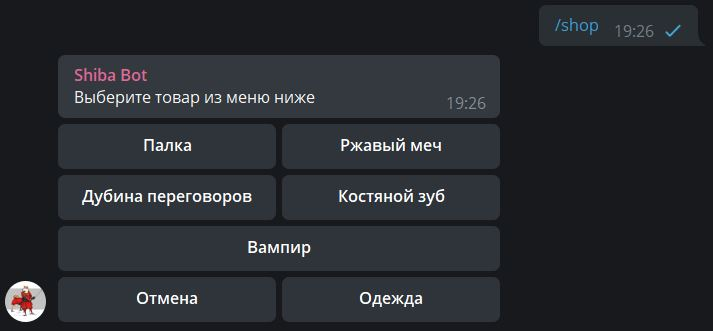

# Шибабот

## Общее

Данный чат-бот представляет собой RPG-игру.

Пользователям, присоединившимся к игре, выдаётся шиба-ину воин.  
Игроки могут сражаться друг с другом на арене или же с монстрами в подземельях.

Шиба-ину обладает рядом характеристик, влияющих на исход сражения: здоровье, ловкость, сила.  
Данные показатели можно улучшать при помощи оружия, одежды и еды, а их базовые значения увеличивать с ростом очков опыта.

## Зависимости

Данный бот использует следующие зависимости:  
* [sqlalchemy](https://docs.sqlalchemy.org/en/14/intro.html#installation)  
* [gino](https://python-gino.org/docs/en/1.0/tutorials/tutorial.html#installation)  
* [asyncpg](https://magicstack.github.io/asyncpg/current/installation.html)  
* [aiogram](https://docs.aiogram.dev/en/latest/install.html)  
* [environs](https://pypi.org/project/environs/#install)  
* [python-dotenv](https://pypi.org/project/python-dotenv/#getting-started)

## Взаимодействие с ботом

Для взаимодействия с ботом и управления персонажем используются чат-команды и инлайн-кнопки в сообщениях.

Список чат-команд:  
> *(список будет пополняться)*  
* `/start` — пользователь вносится в базу данных игроков, для него устанавливаются базовые характеристики воина шиба-ину.
* `/shop` — бот присылает сообщение магазина, через который игрок может приобрести оружие, одежду или еду.
* `/inventory` — бот присылает сообщение инвентаря, через который игрок может экипировать или выбрасывать находящиеся в нём предметы
* `/shiba_rename` — команда для изменения имени шиба-ину воина
* `/duel` — команда для вызова другого игрока на бой. После команды указывается упоминание оппонента через инлайн-меню Telegram. 

Пример работы команды `/shop` и интерфейса магазина:

